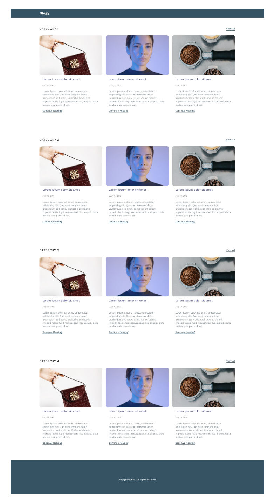

# Требования

Необходимо разработать простой, но полностью рабочий веб-сайт на чистом PHP (без фреймворков) с использованием MySQL и шаблонизатора Smarty. Сайт должен реализовывать функционал блога с категориями и постами.

## Технологический стек:
- [ ] PHP 8.1+
- [ ] Шаблонизатор Smarty
- [ ] База данных MySQL
- [ ] Не использовать фреймворки

## Структура данных:

### Категория:
- [ ] Название
- [ ] Описание

### Статья:

- [ ] Изображение
- [ ] Название
- [ ] Описание
- [ ] Текст
- [ ] Категория (одна или несколько)
- [ ] Кол-во просмотров

## Обязательные страницы:

### Главная страница:

- [ ] Вывести каждую категорию, в которой есть статьи и отобразить 3 последних поста (по дате публикации).
- [ ] Вывести кнопку “Все статьи” для каждой категории.

### Страница категории:

- [ ] Вывести название, описание, список статей
- [ ] Реализовать сортировку статей (по кол-во просмотров, по дате публикации)
- [ ] Реализовать пагинацию

### Страница статьи:

- [ ] Вывести всю информацию о статье
- [ ] Вывести блок из 3 похожих статей

### Дополнительный функционал:

- [ ] Реализовать функционал для сидинга категорий и статей 

### Что будет оцениваться:

- [ ] Простота, читаемость и структура кода
- [ ] Структура проекта
- [ ] Работа с MySQL
- [ ] Уровень самостоятельной реализации
- [ ] Глубина понимания решения

### Будет плюсом:

- [ ] Использование SCSS для стилей
- [ ] Docker-окружение

---

# Plan

- [ ] Init
  - [ ] docker
- [ ] Реализация
  - [ ] 
- [ ] итог
  - [ ] 

---